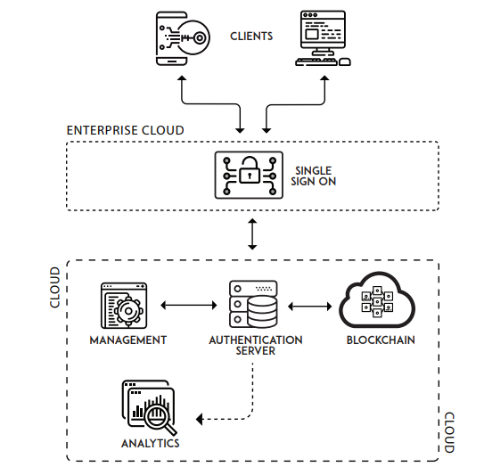

Hypersign is a cryptographic security and identity solution that enables users to access (Web, Federated and Decentralized) applications with a singular identity without providing their credentials.

The protocol validates a digital signature produced by a standard  blockchain algorithm - ECDSA, in a mobile device using authentication service which is a smart-contract deployed on a blockchain and does not rely on central authority and hence providing a complete decentralised environment for identity management.

## Table of contents

* [Quick overview](docs/overview.md)
* [Problem statement](https://github.com/hypermine-bc/hypersign/blob/master/docs/overview.md#problem)
* [Core components](docs/hs-products.md)
* [Possible use cases](https://github.com/hypermine-bc/hypersign/blob/master/docs/overview.md#usecases)
* [Product](docs/screen-shots.md) 
* [Simple Demo](https://www.loom.com/share/62e4f367f2b64c94923c31b07d661b6d)
* [Development Approach](docs/development-approach.md)
* [Hypersign website](http://hypermine.in/hypersign/)
* [Hypersign whitepaper]() (coming up!)

## Hypersign basic architecture

