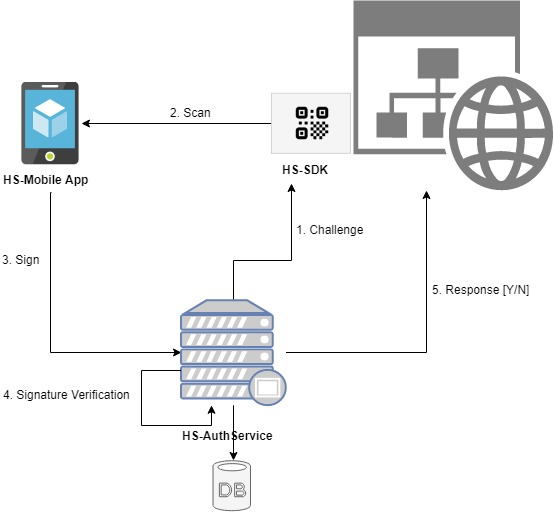
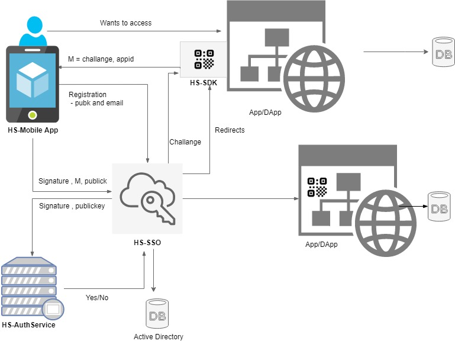

Is a cryptography based SingleSignOn Solution that enables users to securely access applications (web apps as well as DApps) without providing their access credentials [usernames and passwords].

## Table of contents

* [Quick overview](docs/overview.md)
* [Development Approach] (docs/development-approach.md)
* [Hypersign products and components](docs/hs-products.md)
* [Hypersign end to end flow](docs/end2endflow.md)
* [Hypersign website](http://hypermine.in/hypersign/)
* [Hypersign whitepaper]() (coming up!)
* [Problem statement](https://github.com/hypermine-bc/hypersign/blob/master/docs/overview.md#problem)
* [Possible use cases](https://github.com/hypermine-bc/hypersign/blob/master/docs/overview.md#usecases)

## Demo

https://www.loom.com/share/62e4f367f2b64c94923c31b07d661b6d

## Hypersign basic architecture

## Hypersign SSO architecture 

