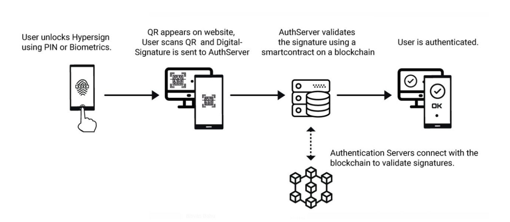
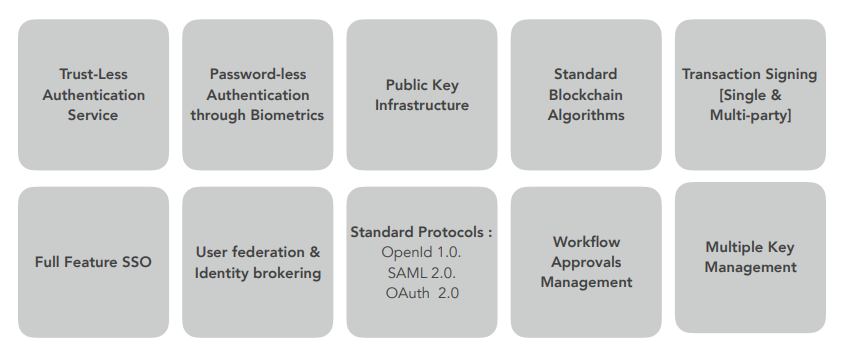

# [Hypersign](http://hypermine.in/hypersign/)

**Hypersign** is a cryptography based SingleSignOn Solution that enables users to securely access applications (web apps as well as DApps) without providing their access credentials [usernames and passwords].

**Components**

 - HS-Mobile App
 - HS-Auth Server
 - HS-SDK
 - HS-SSO

[Here](hs-products.md) is the list of product line.

The protocol further enables a user to securely sign transactions in decentralized environments; the **HS-SDK** allows easy authentication to the Blockchain.  Hypersign uses cryptographic algorithms and equations in the mobile application, totally eliminating the need for usernames and passwords. The Application Server (**HS-Auth Service**) does not store user data, rather it relies on the users private key and public key [generated using the ECDSA - Elliptic Curve Digital Signature Algorithm] stored in users device. 

**Trustless and Decentralized SSO**

Hypersign leverages full fledged SSO feature from an open source software - *KeyCloak* - in order to provide a complete solution for Identity Management and Access Management. As mentioned earlier, Hypersign does not uses username and password, rather uses public key cryptography for access where users have complete control of their private key which never leaves their mobile device whatsoever. The protocol validates the digital signature, produced by ECDSA algorithm in mobile device (**HS-Mobile App**), on **HS-Auth Service** which is nothing but a smart contract deployed on Ethereum Blockchain and not relying on central authority for signature verification and hence providing a complete  trust less and decentralized environment for SSO.

## How does it work?

- User downloads the Hypersign mobile app and goes though the [registration](https://github.com/hypermine-bc/hypersign/blob/master/docs/registration_%26_login.md#registration) process in order to register himself.
- During registration, a key-pair is generated, private key is stored in the user's device and public key is sent to Hypersign AuthServer.
- At the time of login, user unlocks the device using PIN or Biometrics. 
- When user wants to login to a website, which was pre-registered on Hypersign-SSO under a relam or company, the website produces a QR code scan. Visit [here](https://github.com/hypermine-bc/hypersign/blob/master/docs/registration_%26_login.md#login) for complete login process. 
- User scans the QR code, signs the message and sends the digital signature and public key with the login request to Hypersign AuthServer.
- The Hypersign AuthServer, does the preliminary validation and calls the blockchain to verify the digital signature and returns the response. 

## Features

## Usecases

- Online Media Streaming (eliminate password Sharing)
- Banking (username/password dependency)
- Blockchain (Signing Transaction using custom provider)
- SSO (Single Sign On for DApps and WebApps)

**USP**

The protocol is developed keeping all kind of businesses in mind and is highly configurable. It gets easily integrated with all types of applications, be it is Mobile App or Web App or DApp. 

